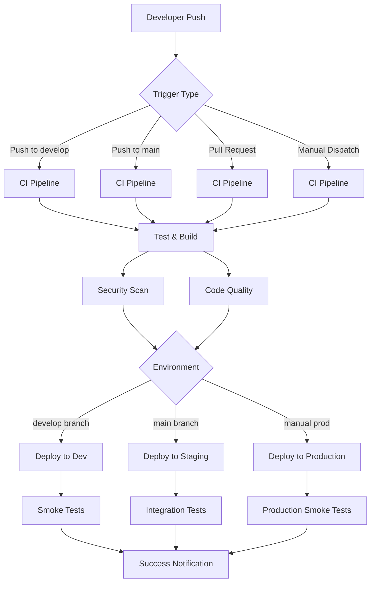

# CI/CD Pipeline Architecture

## 🏗️ Pipeline Overview

## 🔄 Workflow Stages

### 1. Continuous Integration (CI)

#### Test & Build Stage
- **Trigger**: Every push and PR
- **Duration**: ~3-5 minutes
- **Steps**:
  - Checkout code
  - Setup Java 17
  - Cache Maven dependencies
  - Run unit tests
  - Generate test reports
  - Build application JAR
  - Upload build artifacts

#### Security Scan Stage
- **Trigger**: PRs and main branch
- **Duration**: ~2-3 minutes
- **Steps**:
  - OWASP Dependency Check
  - Vulnerability scanning
  - Generate security reports
  - Comment on PRs with findings

#### Code Quality Stage
- **Trigger**: PRs and main branch
- **Duration**: ~2-3 minutes
- **Steps**:
  - SonarCloud analysis
  - Code quality metrics
  - Coverage reports
  - Quality gate evaluation

### 2. Continuous Deployment (CD)

#### Development Deployment
- **Trigger**: Push to `develop` branch
- **Environment**: `development`
- **Duration**: ~5-8 minutes
- **Steps**:
  - Download build artifacts
  - Configure AWS credentials
  - Deploy with SAM CLI
  - Run smoke tests
  - Get API URL
  - Comment on PR with deployment info

#### Staging Deployment
- **Trigger**: Push to `main` branch
- **Environment**: `staging`
- **Duration**: ~5-8 minutes
- **Steps**:
  - Download build artifacts
  - Configure AWS credentials
  - Deploy with SAM CLI
  - Run integration tests
  - Get API URL

#### Production Deployment
- **Trigger**: Manual workflow dispatch
- **Environment**: `production`
- **Duration**: ~5-8 minutes
- **Steps**:
  - Download build artifacts
  - Configure AWS credentials
  - Deploy with SAM CLI
  - Run production smoke tests
  - Get API URL
  - Send Slack notification

### 3. Performance Testing

#### Load Testing
- **Trigger**: Manual workflow dispatch
- **Duration**: Configurable (default 5 minutes)
- **Steps**:
  - Install k6 performance tool
  - Create test scenarios
  - Run load tests
  - Generate performance reports
  - Upload test results

## 🛠️ Technology Stack

### CI/CD Tools
- **GitHub Actions**: Workflow orchestration
- **AWS SAM**: Serverless deployment
- **Maven**: Build and dependency management
- **k6**: Performance testing

### Security & Quality
- **OWASP Dependency Check**: Vulnerability scanning
- **SonarCloud**: Code quality analysis
- **GitHub Security**: Secret scanning

### Monitoring & Notifications
- **AWS CloudWatch**: Application monitoring
- **Slack**: Deployment notifications
- **GitHub**: Status checks and PR comments

## 🔐 Security Considerations

### Secrets Management
- **GitHub Secrets**: Encrypted storage for sensitive data
- **Environment-specific**: Separate secrets per environment
- **Rotation**: Regular secret rotation recommended

### Access Control
- **IAM Roles**: Least privilege access
- **Environment Protection**: Branch protection rules
- **Approval Process**: Required reviewers for production

### Security Scanning
- **Dependency Vulnerabilities**: OWASP scanning
- **Code Quality**: SonarCloud analysis
- **Secret Detection**: GitHub secret scanning

## 📊 Monitoring & Observability

### GitHub Actions
- **Workflow Status**: Real-time status updates
- **Artifact Storage**: Build artifacts and reports
- **Log Aggregation**: Detailed step-by-step logs

### AWS CloudWatch
- **Lambda Metrics**: Invocation count, duration, errors
- **API Gateway Metrics**: Request count, latency, 4xx/5xx errors
- **CloudFormation Events**: Deployment status and rollbacks

### Application Monitoring
- **Health Checks**: Automated health monitoring
- **Performance Metrics**: Response times and throughput
- **Error Tracking**: Exception monitoring and alerting

## 🚀 Deployment Strategies

### Blue-Green Deployment
- **Current**: AWS Lambda with API Gateway
- **Strategy**: CloudFormation stack updates
- **Rollback**: Automatic rollback on failure

### Environment Promotion
- **Development**: Auto-deploy on develop branch
- **Staging**: Auto-deploy on main branch
- **Production**: Manual approval required

### Feature Flags
- **Implementation**: Environment variables
- **Control**: Per-environment configuration
- **Monitoring**: Feature usage tracking

## 🔧 Configuration Management

### Environment Variables
- **Development**: Open CORS, default JWT secret
- **Staging**: Restricted CORS, staging JWT secret
- **Production**: Production CORS, secure JWT secret

### Infrastructure as Code
- **SAM Template**: Serverless infrastructure
- **CloudFormation**: AWS resource management
- **Parameter Store**: Configuration management

### Build Configuration
- **Maven**: Dependency management
- **Java**: Version 17
- **Spring Boot**: Framework configuration

## 📈 Performance Optimization

### Build Optimization
- **Dependency Caching**: Maven dependency caching
- **Parallel Execution**: Concurrent job execution
- **Artifact Reuse**: Build artifact sharing

### Deployment Optimization
- **SAM Build**: Optimized Lambda packaging
- **Cold Start**: Lambda cold start optimization
- **Memory Configuration**: Optimal memory allocation

### Testing Optimization
- **Test Parallelization**: Concurrent test execution
- **Selective Testing**: Changed files only
- **Test Caching**: Test result caching

## 🛡️ Disaster Recovery

### Backup Strategy
- **Code**: GitHub repository
- **Artifacts**: GitHub Actions artifacts
- **Infrastructure**: CloudFormation templates
- **Data**: DynamoDB point-in-time recovery

### Rollback Procedures
- **Code Rollback**: Git revert and redeploy
- **Infrastructure Rollback**: CloudFormation rollback
- **Data Rollback**: DynamoDB restore

### Monitoring & Alerting
- **Deployment Alerts**: Failed deployment notifications
- **Performance Alerts**: SLA breach notifications
- **Security Alerts**: Vulnerability notifications

## 📚 Best Practices

### Development
- **Branch Strategy**: GitFlow with develop/main branches
- **Code Review**: Required PR reviews
- **Testing**: Comprehensive test coverage
- **Documentation**: Up-to-date documentation

### Deployment
- **Environment Parity**: Consistent environments
- **Configuration Management**: Environment-specific configs
- **Monitoring**: Comprehensive observability
- **Security**: Security-first approach

### Operations
- **Incident Response**: Clear escalation procedures
- **Capacity Planning**: Resource monitoring
- **Cost Optimization**: Regular cost reviews
- **Compliance**: Security and compliance checks
